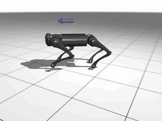
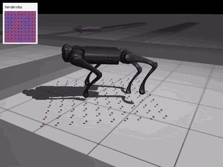
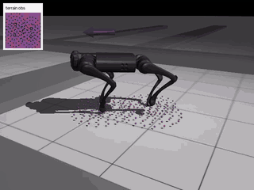

# PPO locomotion and terrain perception for Unitree Go1

Implementation and experiments for PPO-based Unitree Go1 locomotion,
progressing from flat-ground velocity tracking to terrain-aware control using
body- and foot-relative height observations.

This is a simulation-only course project. It has not been deployed on a
physical Go1.

## Project overview

The project contains two completed assignments:

1. a baseline PPO implementation and flat-ground velocity-tracking policy;
2. an exploratory study of how terrain-observation design affects learned
   locomotion over raised, uneven terrain.

The work builds on the [EAI 2026 Lab 1 starter
repository](https://github.com/finnBsch/eai2026_lab1_rl), which supplies much of
the environment and training framework and in turn uses Brax, JAX, and MuJoCo
Playground. See the [original PPO paper](https://arxiv.org/abs/1707.06347) and
the associated [Hugging Face model
archive](https://huggingface.co/kugelblytz/go1-ppo-locomotion).

## My contributions

- Implemented the PPO probability ratio, clipped surrogate objective,
  value-function loss, entropy regularization, and combined loss.
- Trained and evaluated the flat-ground Go1 velocity-tracking policy.
- Designed body-anchored and foot-anchored terrain observations under a
  200-sample budget.
- Added terrain-aware observation, visualization, checkpoint metadata, and
  evaluation tooling.
- Iteratively tuned rough-terrain rewards and trained multiple policies.
- Compared the resulting behaviors through saved deterministic rollouts.

## PPO implementation

For behavior-policy log probability `log pi_old`, updated-policy log
probability `log pi`, advantage `A`, and clipping threshold `epsilon`, the
implementation computes

```text
ratio       = exp(log pi - log pi_old)
policy loss = -mean(min(ratio * A, clip(ratio, 1-epsilon, 1+epsilon) * A))
total loss  = policy loss + value loss - entropy bonus
```

Advantages are computed with generalized advantage estimation and optionally
normalized. The critic term is mean-squared error against the value target;
the entropy term discourages premature collapse to a deterministic policy.
The completed implementation and flat-ground training output are preserved in
[`ppo_flat_ground.ipynb`](ppo_flat_ground.ipynb).

## Terrain perception experiments

The second assignment investigates how observation geometry changes the
behavior a policy can learn:

- **Body-relative sensing:** a fixed 10 x 10 grid is anchored at the torso and
  covers the nearby area. It gives a stable local map, but its sample locations
  do not move independently with the feet.
- **Foot-relative sensing:** four concentric sample patterns are anchored at
  the current foot positions (50 points per foot, 200 total). This concentrates
  the observation budget around prospective contacts as each leg moves.

Sample coordinates are defined in the robot's ego frame and rotated into the
world using torso yaw only, so forward and lateral directions remain aligned
with the robot rather than the global axes. The observed height at each sample
is encoded relative to the terrain height beneath the torso and normalized.
The two designs are recorded in
[`terrain_body_sensing.ipynb`](terrain_body_sensing.ipynb) and
[`terrain_feet_sensing.ipynb`](terrain_feet_sensing.ipynb).

## Reward design

Rough-terrain training used an iteratively tuned balance of:

- linear and angular velocity tracking;
- orientation, vertical-velocity, and roll/pitch angular-motion penalties;
- action-rate, torque, and mechanical-energy penalties;
- terrain-relative foot-clearance reward;
- foot slip, swing duration, and contact shaping where enabled;
- nominal-pose, joint-limit, stand-still, and termination terms.

Foot clearance is measured as foot height minus the sampled terrain height
directly below that foot, and the peak clearance is rewarded on touchdown.
This is more meaningful than absolute world-space foot height: a foot standing
on a raised step may have a large world `z` value while having no clearance at
all. The absolute-height reward is therefore disabled. These terms were tuned
as a coupled objective across multiple runs; the notebooks do not isolate a
causal improvement from every individual term.

## Results and demonstrations

| Stage | Saved rollout | What it shows |
| --- | --- | --- |
| Flat-ground PPO | [](docs/assets/flat-ground-ppo.mp4) | Deterministic policy following a 0.5 m/s forward command on flat terrain. |
| Body sensing | [](docs/assets/rough-terrain-body-sensing.mp4) | Deterministic rough-terrain rollout with the torso-anchored height grid and observation overlay. |
| Feet sensing | [](docs/assets/rough-terrain-feet-sensing.mp4) | Deterministic rough-terrain rollout with four foot-anchored sampling patterns and observation overlay. |

Each preview links to the full 20-second MP4 extracted from the corresponding
notebook output; no simulation was regenerated for this README.

The flat-ground run completed 201,523,200 environment steps. Its saved rollout
uses the requested 0.5 m/s forward command. For rough terrain, the final
training callbacks recorded episode rewards of 104.664 at 201,523,200 steps
for body sensing and 108.363 at 504,627,200 steps for feet sensing. These are
run-specific training-evaluation values with different training budgets, not a
controlled head-to-head metric. The videos establish qualitative behavior,
but the repository contains no shared held-out traversal success rate; the
body-versus-feet comparison should therefore be treated as exploratory.

## Repository structure

| Path | Purpose |
| --- | --- |
| `ppo_flat_ground.ipynb` | PPO loss implementation, flat-ground training, and evaluation |
| `terrain_body_sensing.ipynb` | Final body-anchored terrain experiment |
| `terrain_feet_sensing.ipynb` | Final foot-anchored terrain experiment |
| `custom_ppo_train.py` | Course-derived PPO training loop with a pluggable loss |
| `perceptive_go1.py` | Rough-terrain environment, observations, and reward terms |
| `terrain_samples.py` | Sampling validation and `perception.json` checkpoint metadata |
| `utils.py` | Rollout rendering and terrain-observation overlays |
| `remote_control.py` | Keyboard-controlled local checkpoint evaluation |
| `docs/assets/` | Notebook-extracted MP4 demonstrations and GIF previews |
| `ASSIGNMENT_README.md` | Unmodified course assignment instructions |
| `MODEL_CARD.md` | Checkpoint scope, requirements, and limitations |

Generated checkpoints are excluded from Git and written beneath
`artifacts/notebook_checkpoints/<run timestamp>/`. A rough-terrain checkpoint
must be kept with its adjacent `perception.json`; the metadata fixes the sample
anchors, offsets, coordinate frame, height scale, and terrain mode expected by
that policy. See [`MODEL_CARD.md`](MODEL_CARD.md) for availability details.

## Reproducing the notebooks

The recorded runs used Python 3.12, MuJoCo 3.11, and a CUDA-capable GPU. After
creating and activating a Python 3.12 environment:

```bash
uv pip install -r requirements.txt
uv pip install ipykernel jupyterlab
chmod +x setup_mujoco_headless.sh
./setup_mujoco_headless.sh
jupyter lab
```

For local keyboard evaluation, download a complete checkpoint directory and
run:

```bash
python remote_control.py \
  --checkpoint artifacts/downloaded_checkpoints/<run>/final/params \
  --fullscreen
```

## Course origin and attribution

This repository is a fork and extension of the EAI 2026 reinforcement-learning
course starter. The starter provides the assignment structure and substantial
environment/training code; Brax and MuJoCo Playground provide the underlying
learning and simulation components. My work is the PPO objective
implementation, experiment and perception design, terrain-specific reward
work, policy training and evaluation, and supporting visualization/checkpoint
tooling. All results shown here are from simulation.
