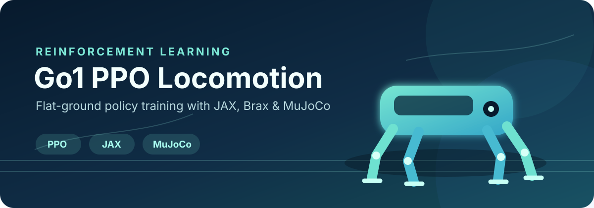
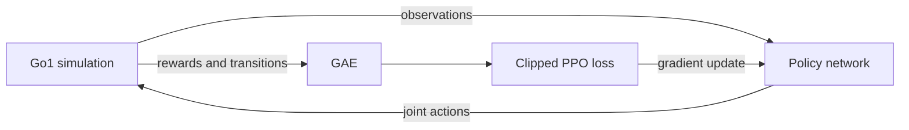

<p align="center">
  
</p>

<p align="center">
  
  
  
  
</p>

This repository contains my implementation and experiments for training a Go1
quadruped with Proximal Policy Optimization (PPO). The project uses JAX for
accelerated learning, Brax for PPO training, and MuJoCo Playground for robot
simulation.

## Links

- **Model and checkpoint:** [Hugging Face — Go1 PPO
  Locomotion](https://huggingface.co/kugelblytz/go1-ppo-locomotion)
- **Course starter repository:** [EAI 2026 Lab 1](https://github.com/finnBsch/eai2026_lab1_rl)
- **Original assignment:** [assignment instructions](ASSIGNMENT_README.md)

## Project status

- **Level E — complete:** implemented the PPO probability ratio,
  clipped surrogate objective, value-function loss, entropy regularization,
  and combined loss, then completed flat-ground Go1 training in `lab1_E.ipynb`.
- **Level C — next:** terrain observations, reward tuning, and rough-terrain
  locomotion are future work.
- **Model archive:** the private
  [Hugging Face model repository](https://huggingface.co/kugelblytz/go1-ppo-locomotion)
  contains the model card; no checkpoint has been exported from Level E yet.

The GitHub repository contains the code and experiment documentation. Hugging
Face contains the model card and will hold the final model weights.

## PPO objective

The custom loss computes the likelihood ratio between the updated and behavior
policies and uses PPO's clipped surrogate objective. It combines that policy
loss with a mean-squared value loss and an entropy bonus:

```text
total loss = clipped policy loss + value loss - entropy bonus
```

The implementation is in [`lab1_E.ipynb`](lab1_E.ipynb).

## Training flow



## Repository contents

| Path | Purpose |
| --- | --- |
| `lab1_E.ipynb` | Custom PPO loss implementation and flat-ground training |
| `lab1_C.ipynb` | Terrain perception, reward design, and rough-terrain training |
| `custom_ppo_train.py` | PPO training loop used by the notebooks |
| `terrain_samples.py` | Terrain-observation specification and checkpoint metadata |
| `remote_control.py` | Keyboard-controlled evaluation of a trained policy |
| `requirements.txt` | Reproducible Python dependencies |

## Environment setup

The tested environment uses Python 3.12, MuJoCo 3.11, and a CUDA-capable GPU.
From the repository root:

```bash
curl -LsSf https://astral.sh/uv/install.sh | sh
source "$HOME/.local/bin/env"

uv python install 3.12
uv venv --python 3.12 .venv
source .venv/bin/activate

uv pip install -r requirements.txt
uv pip install ipykernel jupyterlab

chmod +x setup_mujoco_headless.sh
./setup_mujoco_headless.sh
```

Verify the environment:

```bash
python --version
python -c "import jax, mujoco; print(jax.devices()); print(mujoco.__version__)"
```

Python should report version 3.12, JAX should list a CUDA device, and MuJoCo
should report version 3.11.0.

## Running the experiments

Start JupyterLab and open either notebook:

```bash
jupyter lab
```

The notebook training cells default to 200 million environment steps. For a
short validation run, reduce `ppo_training_params["num_timesteps"]` before
starting training.

Level C writes evaluation and final checkpoints beneath:

```text
artifacts/notebook_checkpoints/<run timestamp>/
```

Generated artifacts are intentionally excluded from Git.

## Using the trained policy

Download the complete final checkpoint directory from the
[Hugging Face model repository](https://huggingface.co/kugelblytz/go1-ppo-locomotion).
It must contain both `params` and `perception.json`. Then run:

```bash
python remote_control.py \
  --checkpoint artifacts/downloaded_checkpoints/<run>/final/params \
  --fullscreen
```

Controls: W/S for forward and backward velocity, A/D for lateral velocity,
Q/E for yaw, X or Space to stop, R to reset, and Escape to exit.

## Results

### Level E

The custom PPO objective is complete and the notebook is configured for a
200-million-step flat-ground Go1 training run. The notebook displays the
evaluation reward curve and rollout videos during execution. Because those
outputs have not been saved into the notebook file, this README does not report
an unsupported final reward or embed a synthetic training curve.

Level C terrain experiments and exported checkpoints will be reported
separately when they are completed.

## Origin

This project was developed from the EAI 2026 Lab 1 starter repository. The
[original assignment instructions](ASSIGNMENT_README.md) are preserved for
reference. The PPO loss implementation, perception design, reward experiments,
trained policy, and reported results in this fork represent my project work.
